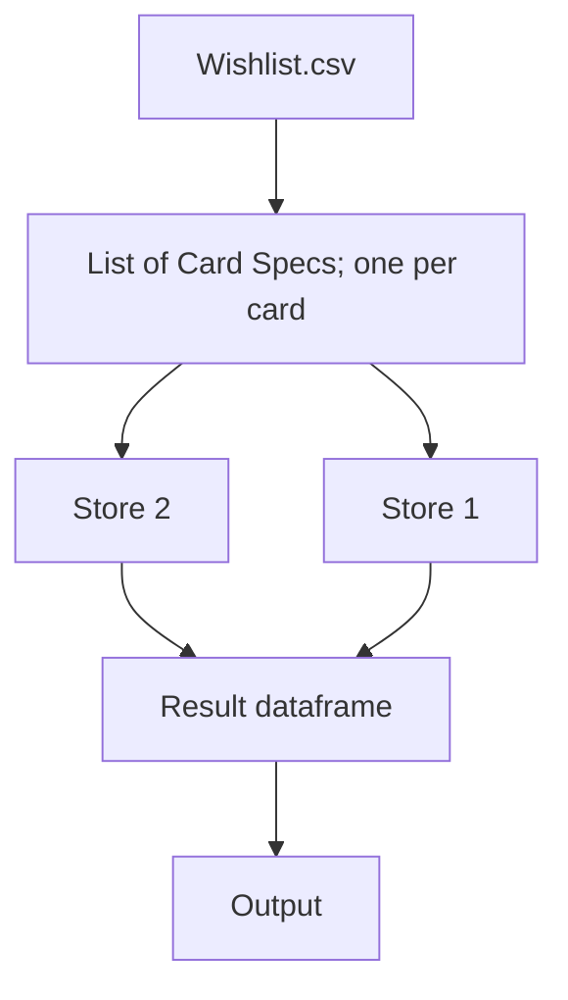

# mtg-price-checker/README.md

# MTG Price Checker

MTG Price Checker is a Python application that allows users to search for Magic: The Gathering card prices using the Scryfall API and scrape or search store prices, converting the results to AUD.

## Features

- Scrape prices from various online stores.
- Convert prices to Australian Dollars (AUD).



## TODO 
- add enforce non-foil as cli option
- Add cards to cart for user
- Add more Australian stores
- When GUI added, after show an editable table before initiating search
- Rate-limit binderpos searches
- async
- ttl cache
- ini config (default card language, local currency to convert to, which stores to use, filter behaviour)
- switch vendorAPI to protocol.
- use itertools.filterfalse to implement filtering against unfiltered results from a vendor search-by-name.
   like:
      itertools.filterfalse(lambda cardname: filter_fn(vendor.search_name(cardname)), card_specs)

## Installation

1. Clone the repository:
   ```
   git clone https://github.com/yourusername/mtg-price-checker.git
   ```
2. Navigate to the project directory:
   ```
   cd mtg-price-checker
   ```
3. Make the venv:
   ```
   
   ```
4. Install the required dependencies:
   ```
   pip install -r requirements.txt
   ```

## Usage

To run the application, execute the following command:
```
python src/main.py
```


## Contributing

Contributions are welcome! Please open an issue or submit a pull request for any enhancements or bug fixes.

## License

This project is licensed under the MIT License. See the LICENSE file for details.